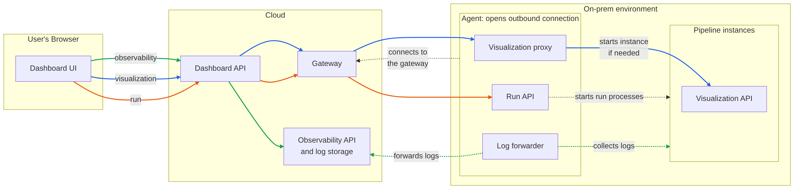
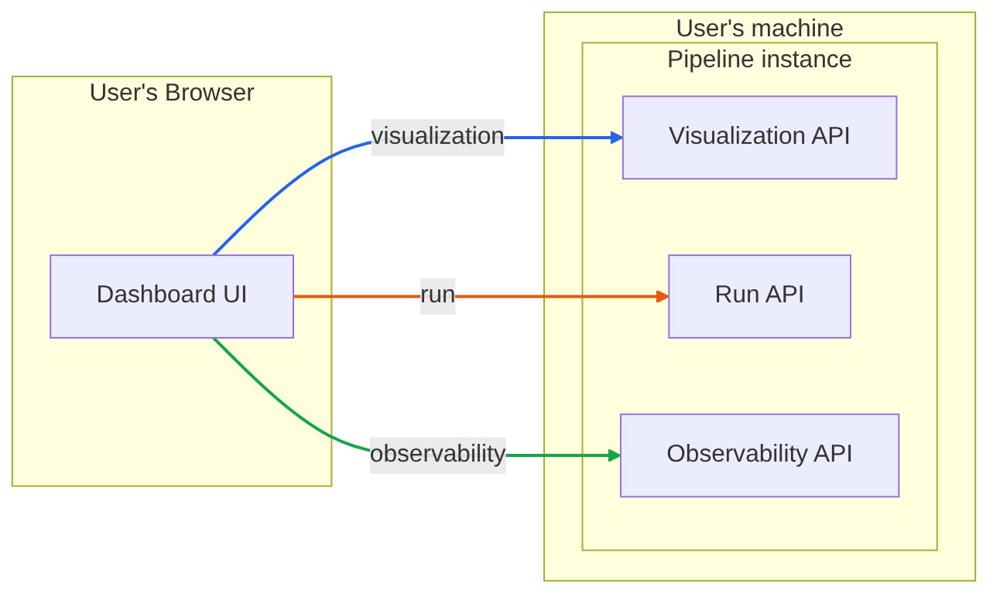

# Cloud connectivity architecture

# Context

A datapipe pipeline is a Python module that defines a `DatapipeApp`: a catalog
of tables, the pipeline steps, and a `DataStore` pointing to the metadata
database. The pipeline code and its data live in the customer's environment
("on-prem"): their databases, their storage, their GPUs.

Today there are two ways to work with a pipeline, both local to that
environment:

* `datapipe run` loads the pipeline and executes its steps once (or
  continuously with `--loop`). A run exists only as this process: there is no
  run id and no run history, status is the exit code, logs are stdout. Runs are
  started from a shell, cron, or whatever scheduler the environment has.
* `datapipe api` loads the pipeline and serves the Datapipe Ops API
  (`/api/v1alpha3`, `datapipe-app`) together with the web UI (`datapipe-ui`).
  The API shows pipeline state: graph, stages, table data, transform metadata
  and changed-row counts. It also has two operations that modify state: reset
  transform metadata, and run a single transform — the latter executes inside
  the API process. `/capabilities` already has flags for run history, run
  start/stop and run logs, but they are disabled.

This leads to three problems:

1. **Access.** To open the UI a user needs network access to the host running
   `datapipe api`. On-prem environments are usually behind NAT and firewalls
   that allow only outbound connections (often only HTTPS, sometimes through a
   proxy), so every environment needs a VPN or port forwarding.
2. **Idle cost.** `datapipe api` is a long-running process that imports the
   pipeline module. Whatever the pipeline allocates at import time (models, GPU
   memory) stays allocated while the UI is up, even when nobody is looking and
   nothing is computing.
3. **No run management.** Runs are processes started outside of datapipe, so
   there is no way to start a run from the UI, see which runs are in progress,
   check how past runs ended, or read their logs.

# Goal

Make pipelines observable and operable from a dashboard in two target
scenarios. Both must work.

## Target scenarios

* **Cloud.** A cloud-hosted backend and dashboard communicate remotely with
  pipelines in on-prem environments.
* **Local.** Without the cloud, a user spawns a pipeline and a dashboard on
  their own machine and performs base operations: look at pipeline state,
  start and cancel runs, check run status and logs.

## Capabilities

The dashboard covers three areas:

* **Visualization** — current state of a pipeline: graph, stages, table data,
  transform metadata.
* **Run** — start a pipeline run, list runs, inspect the status of running and
  finished runs, cancel a run.
* **Observability** — logs, metrics and traces of pipeline runs and pipeline
  processes.

## Requirements

1. **Outbound-only connectivity (Cloud).** The on-prem environment opens only
   outbound connections to the cloud. No inbound ports, no VPN.
2. **Scale to zero (Cloud).** Expensive resources (GPU) are held only while
   there is work that needs them. When nobody is looking at a pipeline and
   nothing is running, only a small always-on footprint remains.
3. **Idle pipelines still answer (Cloud).** A dashboard request that arrives while the
   pipeline is scaled to zero waits for it to start instead of failing.
4. **Many environments (Cloud).** One cloud serves many on-prem environments.
   Each environment authenticates to the cloud and receives only requests
   addressed to it.

## Non-goals

* **Moving compute or data to the cloud.** Pipelines execute on-prem. Data
  leaves the environment only as responses to explicit dashboard requests and
  as logs forwarded to the cloud.

# Approach

Cloud scenario:

Diagram source: [cloud.mmd](cloud.mmd)

Local scenario:

Diagram source: [local.mmd](local.mmd)

Each capability area is a separate API: visualization API, run API,
observability API. The dashboard uses the same APIs in both scenarios; the
scenarios differ in which component serves them:

| API | Cloud | Local |
|---|---|---|
| Visualization | pipeline instance, reached through the gateway and the agent | pipeline instance |
| Run | agent | pipeline instance |
| Observability | cloud, from logs the agent forwards | pipeline instance |

Components:

* **Dashboard UI** — the web app in the user's browser, the same in both
  scenarios.
* **Pipeline instance** — a process that loads the pipeline code. Serves the
  visualization API and executes runs; in Local it also serves the run and
  observability APIs.
* **Agent** (Cloud only) — a light, always-on on-prem component. It has a
  small footprint and does not import pipeline code, so it can run permanently
  and does not need redeploying when the pipeline changes. Connects to the
  gateway, serves the run API, proxies visualization requests to pipeline
  instances (starting them when needed and stopping them when idle), and
  forwards logs to the cloud.
* **Dashboard API** (Cloud only) — the cloud entry point for the dashboard UI.
  Sends visualization and run requests through the gateway and observability
  requests to the observability API.
* **Gateway** (Cloud only) — accepts agent connections and routes requests to
  the right agent.
* **Observability API and log storage** (Cloud only) — stores logs forwarded
  by agents and serves the observability API.

## Cloud

The agent is the only on-prem component that is always up and the only one
that talks to the cloud. It opens an outbound connection to the gateway and
keeps it open; all cloud requests arrive over it. Pipeline instances never
talk to the cloud.

The agent serves the run API itself and forwards visualization API requests
to a pipeline instance. If none is running, it starts one and holds the
request until it is ready. This gives both scale to zero and requests that
survive it.

The agent also forwards logs of runs and pipeline instances to the cloud
over the same connection. Logs live in the cloud: it stores them and serves
the observability API itself, so logs stay readable while the environment is
scaled to zero or offline.

## Local

There is no agent. The user starts a pipeline instance together with the
dashboard on their machine, as `datapipe api` does today, and the dashboard
talks to it directly. The pipeline instance serves all three APIs. Scale to
zero does not apply: the user decides how long the process runs.

# APIs

The visualization, run and observability APIs, how they derive from the
v1alpha3 Ops API, and open questions about them are described in
[01-APIs.md](01-APIs.md).

# Agent and Gateway

How the agent and the gateway connect, authenticate, route requests, start
pipeline instances on demand and forward logs is described in
[02-Agent-and-Gateway.md](02-Agent-and-Gateway.md).
