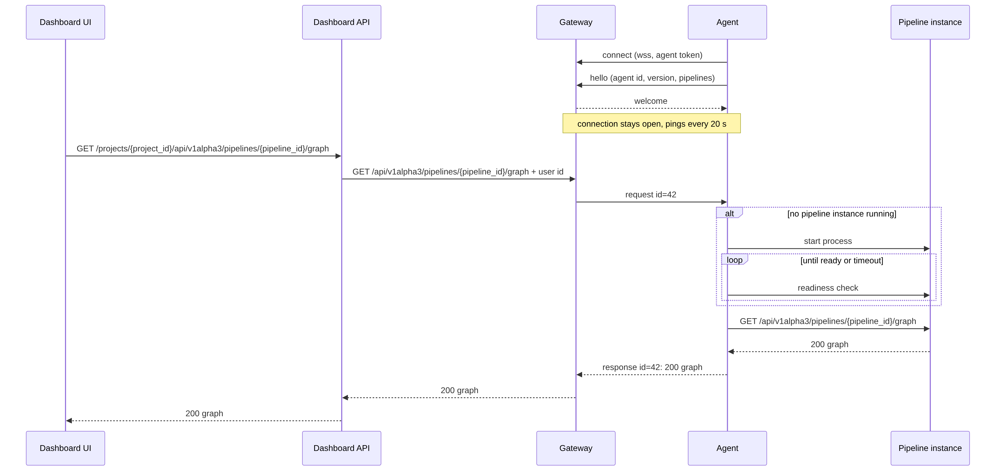

# Agent and Gateway

Part of [Cloud connectivity architecture](00-Overview.md).

The agent (on-prem) and the gateway (cloud) carry every request between the
cloud and an on-prem environment. The agent connects out to the gateway and
keeps the connection open; the gateway never connects in. Over this one
connection the gateway sends visualization and run requests down, and the
agent sends responses and forwarded logs up.



Diagram source: [agent-request.mmd](agent-request.mmd)

## Responsibilities

**Gateway:**

* Accepts agent connections and authenticates agents.
* Keeps a registry of connected agents: which project an agent belongs to,
  which pipelines it serves, which gateway replica holds its connection.
* Routes requests from the Dashboard API to the right agent and returns the
  responses.
* Passes forwarded logs to log storage and acknowledges them.

**Agent:**

* Connects to the gateway and reconnects when the connection drops.
* Announces the pipelines it serves, taken from its own configuration.
* Dispatches each incoming request by path: run API requests it handles
  itself, visualization requests go to its visualization proxy.
* Starts and stops pipeline instances and run processes.
* Forwards logs to the gateway.

## Connection

**Transport.** A WebSocket over HTTPS (`wss://`, port 443), opened by the
agent. It passes corporate HTTP proxies (the agent honours `HTTPS_PROXY`) and
ordinary load balancers, and needs no end-to-end HTTP/2, unlike gRPC.

**Tunneled HTTP.** The connection carries plain HTTP requests and responses,
wrapped in messages. The APIs in [01-APIs.md](01-APIs.md) stay ordinary HTTP:
the agent replays a request against a local HTTP server — a pipeline
instance, or its own run API — and sends the response back. The same API code
serves Local and Cloud.

**Multiplexing.** Many requests are in flight on one connection at once; every
message carries the id of the request it belongs to. Large bodies (table
pages) are split into chunks, so one big response does not hold up the
others.

**Messages:**

| Message | Direction | Content |
|---|---|---|
| `hello` | agent → gateway | agent id, agent version, pipelines it serves |
| `welcome` | gateway → agent | session id, limits (max body size, timeouts) |
| `request` | gateway → agent | id, method, path, headers, body |
| `response` | agent → gateway | id, status, headers, body (possibly in chunks) |
| `cancel` | gateway → agent | id of a request the caller gave up on |
| `logs` | agent → gateway | a batch of log lines, each with run id and `seq` |
| `logs-ack` | gateway → agent | highest `seq` stored, per run |

**Liveness.** WebSocket pings every 20 s in both directions. A side that
misses several pings closes the connection. The agent reconnects with
exponential backoff and jitter (1 s up to 60 s).

## Authentication and trust

* **Agent token.** Registering an environment in a project creates an agent
  token. It is stored on-prem as a secret and sent when the agent connects.
  The gateway maps the token to a project and an agent id. An agent can have
  several valid tokens at once, so tokens can be rotated without downtime.
* **One connection per agent.** If an agent id connects again while an older
  connection is still open (typically a half-open connection after a network
  change), the newest connection wins and the older one is closed.
* **Allowlisted routes.** The agent accepts only the routes of the run and
  visualization APIs, for pipelines in its own configuration. There is no
  generic "execute this" message. This is the security boundary: whoever
  controls the cloud side can do what these APIs allow and nothing more.
* **User identity.** Users authenticate to the Dashboard API. The gateway
  passes the user id to the agent in a header, and the agent records it with
  the runs it starts.
* **Gateway identity.** The agent verifies the gateway's TLS certificate as
  usual. It never accepts requests from anything but its own outbound
  connection.

## Routing

The Dashboard API sends `/api/v1alpha3/pipelines/{pipeline_id}/…` to the
gateway, together with the project id and the user id. The gateway looks up
the agent that serves this pipeline in this project and forwards the request
as a `request` message.

* **No agent connected.** The gateway answers `503` with an "agent offline"
  error, and the dashboard shows the environment as offline. The observability
  API keeps working, because logs live in the cloud.
* **Several gateway replicas.** An agent connects to whichever replica the
  load balancer picks. The registry lives in a shared store and records which
  replica holds each agent's connection. A replica that receives a request for
  an agent connected elsewhere forwards it to that replica. Registry entries
  expire unless the holding replica refreshes them.

**Timeouts.** The gateway waits for a response up to a per-route timeout:
long enough for a pipeline instance to start for visualization requests (60 s
by default), short for run API requests (10 s). When the caller disconnects or
the timeout expires, the gateway sends `cancel`, and the agent aborts the
local request.

## Visualization proxy

The agent keeps at most one pipeline instance per pipeline for visualization:

* **Start on demand.** On a visualization request with no instance running,
  the agent starts one, polls its readiness endpoint, and holds the request
  (and any that arrive meanwhile) until it is ready. If the instance fails to
  start, the agent answers `503` with the tail of its output.
* **Stop when idle.** The agent stops the instance after a period without
  visualization requests (15 min by default, configurable per pipeline).
* **Local port.** The instance listens on a local port chosen by the agent and
  is not reachable from outside the machine or cluster.

Run processes are separate: the run API starts one per run, and it exits when
the run ends (see [01-APIs.md](01-APIs.md)).

## Log forwarding

The agent reads new lines from the run logs backend, plus the raw output of
the processes it starts, and sends them in `logs` messages. The gateway
writes them to log storage and replies with `logs-ack`.

The agent keeps the last acknowledged `seq` per run on local disk. After a
reconnect or an agent restart it resumes from there, and log storage drops
duplicates. The on-prem run logs backend is the buffer: while the cloud is
unreachable, logs keep accumulating there and are forwarded once the
connection is back. Only raw process output needs its own spool, a file per
process, deleted once acknowledged.

## Failures

| Situation | Behaviour |
|---|---|
| Connection drops | In-flight requests fail with `502` at the gateway. The agent reconnects; log forwarding resumes from the last acknowledged `seq`. Pipeline instances and runs keep going. |
| Agent restarts | The agent finds the pipeline instances and run processes it started earlier and adopts or stops them; runs whose process is gone are reconciled as described in [01-APIs.md](01-APIs.md). |
| Gateway replica restarts | Its agents reconnect to other replicas, and the registry follows. |
| Cloud unreachable for long | Pipelines keep working on-prem, including runs started by cron. Logs are forwarded when the connection is back. |
| Pipeline instance fails to start | The visualization request gets `503` with the tail of the instance output. |

## Agent configuration

The agent is configured by a file on-prem; the cloud cannot change it. For
example:

```yaml
gateway_url: wss://gateway.example.com/agent
token_env: DATAPIPE_AGENT_TOKEN

pipelines:
  - id: detection
    workdir: /srv/pipelines/detection
    instance:
      command: datapipe --pipeline app:app api --port {port}
      idle_timeout: 15m
    run:
      command: datapipe --pipeline app:app run
```

The first version starts processes directly. Other backends (Docker,
Kubernetes jobs) can plug in behind the same start / stop / status interface.

## Open questions

* **Projects and environments.** Is an agent the same thing as an
  environment, and can a project have several agents (for example, one per
  site)? The registry and routing above allow several agents per project, as
  long as each pipeline is served by one agent.
* **Starting state in the dashboard.** Should the agent expose whether a
  pipeline instance is stopped, starting or ready, so the dashboard can show
  "starting" instead of a long-loading request?
* **Response size.** What limit do we put on a single response, and do table
  pages need real streaming rather than chunking?
* **Registry store.** Postgres, which the cloud already needs, or Redis?
