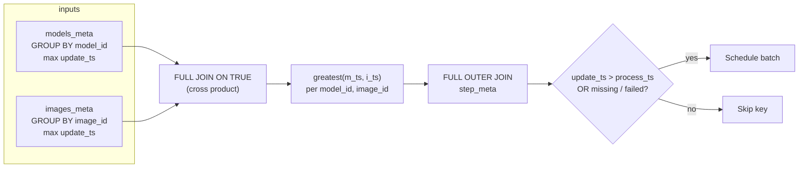

# Transform Grain

A `BatchTransform` does not schedule work row-by-row on every table. It schedules at a **transform grain**: the set of columns in **`transform_keys`** that define one unit of work — one batch index, one call to `func`, one row (or tuple of rows) in `{step}_meta`.

Getting the grain wrong is the most common reason pipelines "re-run everything" or "never join inputs correctly."

## Default grain

If you omit `transform_keys`, Datapipe infers them from the intersection of input and output primary keys. When all tables share `(word_id)`, the grain is `word_id`. When child outputs add columns (1-to-N), the shared parent keys become the grain.

Override explicitly whenever:

- Multiple input tables contribute different key columns.
- The natural batch is a **cross product** (model × image).
- Input PK names differ (`Required` / key mapping).

## Multi-input: `max(update_ts)` per input

Each input table is aggregated to the transform keys it shares with the step. Datapipe takes **`max(update_ts)`** per group — the latest change signal for that input at this grain.

Those aggregates are joined into one row per transform key. The combined input timestamp is the **greatest** of the per-input maxima:

```text
dirty input signal = max( max(update_ts) over input₁, max(update_ts) over input₂, … )
```

Compared against `{step}_meta.process_ts`, this decides whether the transform key runs.

## Cross-product joins

When two inputs share **no** primary-key columns with each other (only with `transform_keys` via separate columns), the aggregate CTEs join on `TRUE` — a **full cross product** at the transform grain.

Example: `models(model_id)` and `images(image_id)` with `transform_keys=["model_id", "image_id"]` → one work unit per `(model_id, image_id)` pair. Updating one model re-dirties every pair involving that model.



## `InputSpec`, `OutputSpec`, and key mapping

Plain table names assume matching primary keys. When names or grains differ, use specs:

```python
BatchTransform(
    infer,
    inputs=[
        "models",
        Required("images", keys={"image_id": "image_id"}),
    ],
    outputs=[
        OutputSpec("predictions", keys={"model_id": "model_id", "image_id": "image_id"}),
    ],
    transform_keys=["model_id", "image_id"],
)
```

- **`InputSpec` / `Required`** — `keys={transform_col: table_col}` maps transform index columns onto the input table (including renames). `Required` also makes the input an **inner** join; bare inputs use a **full** join.
- **`OutputSpec`** — `keys={transform_key: output_pk}` maps batch `idx` to output primary keys for `processed_idx` cleanup.

Misaligned specs break joins in the scheduling SQL or disable output cleanup. See [`Required` / `InputSpec` / `OutputSpec`](../reference/types.md).

## Relationship to `processed_idx`

Transform grain = scheduling + batching. **`processed_idx`** = output cleanup scope for that batch, mapped through `OutputSpec` to each output table's PKs. Same parent grain can map to many child rows; see [Output Cleanup and `processed_idx`](./processed-idx.md).

## Tips & pitfalls

| Pitfall | Symptom | Fix |
|---|---|---|
| **Implicit grain on multi-input** | Wrong keys inferred; cartesian explosion or no matches | Set `transform_keys=` explicitly |
| **Cross product surprise** | One model change re-runs all image pairs | Expected — narrow inputs, filters, or redesign grain |
| **`Required` vs optional input** | Keys present in only one input never schedule (`Required`) or schedule with nulls on the missing side (optional) | Use [`Required`](../reference/types.md#required) only when every input row must exist; otherwise leave the input bare (full join). Runtime detail: [`ComputeInput.join_type`](../reference/compute-step.md#computeinput) |
| **Child table as input without parent keys in grain** | Over- or under-scheduling | Include parent keys in `transform_keys` |
| **Mismatched `OutputSpec` keys** | Stale output rows never deleted | Align `keys=` with transform and output PKs |

## See also

- [Primary Keys and Transform Keys](./primary-keys.md) — PK vs transform key basics
- [Incremental Processing](./incremental-processing.md) — dirty predicate overview
- [Change Detection and Merging](../explanation/change-detection.md) — multi-input SQL detail
- [Key Mapping](../how-to/key-mapping.md) — practical join patterns
- [Model Inference](../how-to/model-inference.md) — cross-product example
