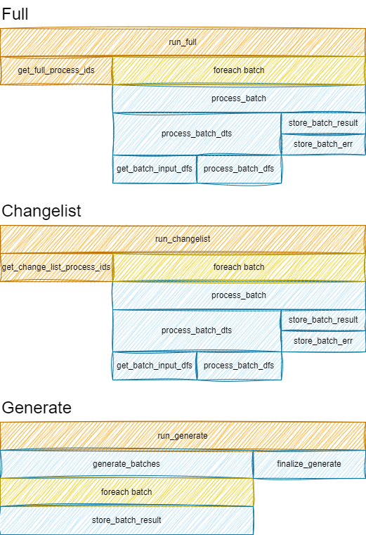

# Compute Step Lifecycle

A pipeline node at runtime is a `ComputeStep`: inputs (`input_dts`), outputs (`output_dts`), and logic that turns indexes into writes. For `BatchTransform`, the concrete class is `BatchTransformStep` (subclass of `BaseBatchTransformStep`).

This page follows that path. Generators (`BatchGenerate`) use a different lifecycle — see the note at the end.

## Entry points

| Entry | What selects work | Then |
|---|---|---|
| `run_full` | `get_full_process_ids` — SQL over dirty transform keys | Batches via executor → `process_batch` |
| `run_changelist` | `get_change_list_process_ids` — dirty keys restricted by a `ChangeList` | Same `process_batch` |
| `run_idx` | Caller-supplied `IndexDF` | Single `process_batch` |

`run_full` / `run_changelist` hand `(idx_count, idx_gen)` to `executor.run_process_batch(..., process_fn=self.process_batch)`.

How dirty keys are computed: [Change Detection and Merging](./change-detection.md).

## Call tree for one batch

```text
process_batch(ds, idx, run_config)
├── process_ts = now
├── process_batch_dts(ds, idx, run_config)
│   ├── get_batch_input_dfs  → list[DataFrame] from each input DataTable
│   ├── if no idx param and all inputs empty → return None   # delete path
│   └── process_batch_dfs    → user func(*input_dfs, …)
├── on success → store_batch_result(...)
│   ├── for each output: DataTable.store_chunk(df, processed_idx=…)
│   │   or, if output_dfs is None: delete_by_idx for existing keys in idx
│   └── transform meta: mark_rows_processed_success(idx, process_ts)
└── on exception (unless fail_fast)
    └── store_batch_err(...) → mark_rows_processed_error(idx, error=…)
```

### `process_batch_dts`

1. Load input frames for the batch index (`get_batch_input_dfs`).
2. If the user function does **not** declare `idx` and every input frame is empty, return `None` — Datapipe treats that as “delete outputs for this idx” without calling `func`.
3. Otherwise call `process_batch_dfs`, which invokes the user function (injecting `ds` / `idx` / `run_config` when those parameters exist).

### `store_batch_result`

- Non-`None` outputs: one DataFrame (or tuple) per output table; each `store_chunk` uses a mapped `processed_idx` so keys present in the batch but absent from the result are soft-deleted.
- `None`: delete existing output rows for the batch index, then still mark the transform keys successful.
- Always updates `{step}_meta` (`process_ts`, `is_success=True`, clear `error`).

### `store_batch_err`

Logs the exception, records it on the event logger, and marks transform meta unsuccessful (`is_success=False`, `error=…`). Those keys stay dirty for a later run.

## Diagram



Source editable as [`transformation-lifecycle.drawio`](transformation-lifecycle.drawio).

## Generators differ

`BatchGenerate` does **not** walk this index → `process_batch` loop.

It builds a `DatatableTransformStep` whose function runs `do_batch_generate`:

1. Call the user **generator** once.
2. For each yielded chunk, `store_chunk` into each output table (no transform-key scheduling SQL).
3. Optionally `delete_stale_by_process_ts` so rows not touched in this run are soft-deleted.

There is no per-key `process_batch` / transform-meta success marking of the BatchTransform kind. Idempotent seeds still rely on table-level hash / `update_ts` so downstream transforms skip unchanged content.

## See also

- [Pipeline Steps](../concepts/pipeline-steps.md)
- [Incremental Processing](../concepts/incremental-processing.md)
- [BatchTransform](../reference/steps/batch-transform.md)
- [BatchGenerate](../reference/steps/batch-generate.md)
