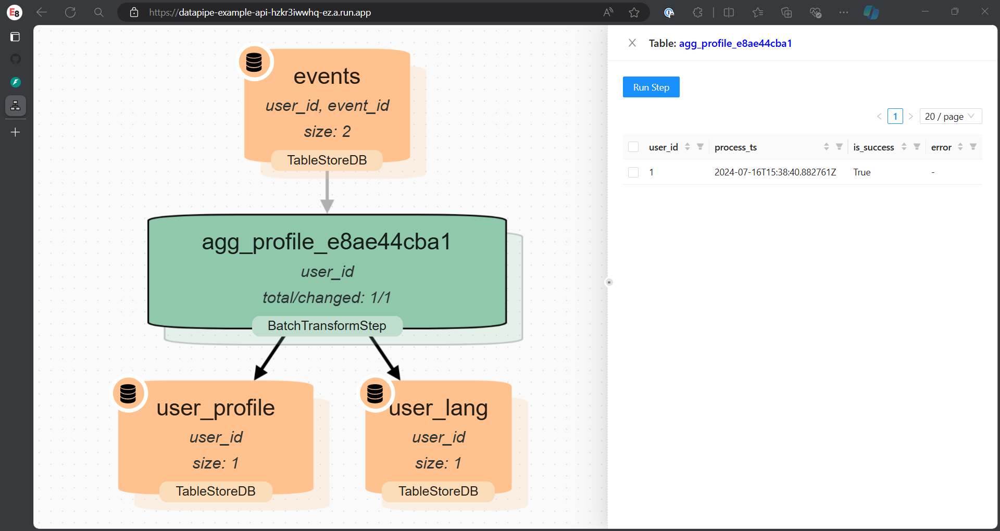

# datapipe-app

`datapipe-app` implements two aspects to make every [datapipe](https://github.com/epoch8/datapipe) pipeline to work as
an application.

From the monorepo root:

```bash
uv sync --package datapipe-app --package datapipe-core --extra sqlite
uv run pytest libs/datapipe-app/tests
```

1. REST API + debug UI based of FastAPI
1. `datapipe` CLI tool

## Common usage

Common pattern to use `datapipe-app` is to create `app.py` with the following code:

```
from datapipe_app import DatapipeApp

from pipeline import ds, catalog, pipeline

app = DatapipeApp(ds, catalog, pipeline)
```

Where `pipeline` is a module that defines common elements: `ds`, `catalog` and
`pipeline`.

## REST API + UI

`DatapipeAPI` extends `DatapipeApp` with an **Ops dashboard** (default `/`) and **Debug UI** (`/debug`).

Environment variables:

- `DATAPIPE_APP_MODE=agent|central` — agent writes observability for one pipeline; central reads all
- `DATAPIPE_APP_PIPELINE_ID` — registry key (agent mode)
- `DATAPIPE_APP_OBSERVABILITY_DB_URL` — optional; defaults to pipeline DB

Ops API: `/api/v1alpha3/overview`, `/metrics/charts`, `/runs`, `/training/{run_key}/curves`.

ML metrics/training enrichments: install `datapipe-ml[observability]`.

`DatapipeAPI` inherits from `FastApi` app and can be started with datapipe CLI
or directly with server like `uvicorn`.

```
datapipe --pipeline app:app api
```

### UI



### REST API

API documentation can be found at `/api/v1alpha1/docs` sub URL.
